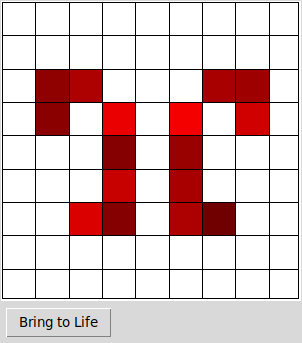

# :dna: Game of Life 

A personalized game of life generator


## :tada: Examples

### :rocket: Game of Life in action


## :spiral_calendar: Dates

### :rocket: Started 
Project pitched and started the _3rd november 2020_

### :dart: Release date 
First expected release the friday **20th november 2020** 


## dependencies
1. Set your Virtual Environment :

	``` bash
	# Download venv librairy
	apt-get install python3-venv -y
	# Create your venv
	py -m venv my_venv
	# Activate your venv
	. venv/bin/activate
	```
	
	_For more information, go to [Python Virtual Environment Official Documentation](https://docs.python.org/3/library/venv.html)._


1. Install your dependencies

	``` bash
	pip3 install pygame
	```

## :clipboard: Tasks

### Game of Life Generator

- [x] Pick randomly or generate a starting state
- [x] show each round
- [ ] Draw on canvas
- [ ] Pick or generate a number of rounds


### Rules

- [x] Any live cell with two or three live neighbours survives
- [x] Any dead cell with three live neighbours becomes a live cell
- [x] All other live cells die in the next generation


## :robot: More examples

### :skull: Still Life's "Headless man" examples




## :handshake: Contributors

<a href="https://github.com/Manfred-Madelaine-pro/game-of-life/graphs/contributors">
  
</a>

Made with [contributors-img](https://contrib.rocks).
